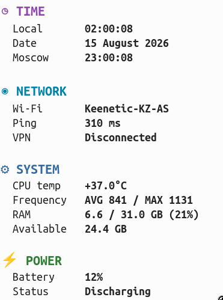

# sensors-info-linux

Small Linux desktop utility that shows current system information in a desktop notification.

## Information displayed

The notification is grouped into four sections.

**TIME**

- local time from the current Linux system timezone;
- current date;
- Moscow time.

**NETWORK**

- Wi-Fi network name;
- network ping;
- VPN status.

**SYSTEM**

- CPU temperature;
- CPU frequency split by efficiency cores and the remaining cores, with core count and average frequency for each group;
- used RAM, total RAM, and usage percentage;
- fan speeds, when the kernel exposes them.

**POWER**

- current power profile from `powerprofilesctl get`;
- battery charge limits as `start - end` thresholds from
  `/sys/class/power_supply/BAT0/charge_control_{start,end}_threshold`
  (`n/a` when the kernel does not expose them);
- battery status from `/sys/class/power_supply/BAT0/status`
  (`Charging`, `Discharging`, `Not charging`, `Full`);
- current battery charge level in percent.

## Example



## Requirements

- Linux
- `notify-send` (libnotify)
- a notification daemon, for example dunst
- `nmcli` (NetworkManager) for VPN status
- `powerprofilesctl` (power-profiles-daemon) for the active power profile
- lm-sensors data for CPU temperature (`coretemp`)

## Build and run

```bash
go build -o sensors-info-linux
./sensors-info-linux
```

The notification is titled `System info` and closes after 5 seconds.

## CPU frequency

The utility reads current CPU frequencies the same way btop does: from
`/sys/devices/system/cpu/cpufreq/policy*/scaling_cur_freq`. If that is
unavailable, it falls back to `/proc/cpuinfo` (`cpu MHz` lines).

On hybrid Intel CPUs, cores are split using `/sys/devices/cpu_atom/cpus`
(efficiency cores) and the remaining logical CPUs (performance cores).
The count is the number of physical cores in the group. `avgMHz` is the
average instantaneous frequency of all logical CPUs in that group.

On CPUs without efficiency cores, a single `cores` group is shown.

Example:

```text
CPU freq.  E-cores 8 1840(avgMHz) / P-cores 2 2610(avgMHz)
```

## RAM usage

RAM usage is calculated using the amount of memory currently available to applications:

```text
used = total - available
```

The notification shows usage percentage, used memory, and total memory.

Example:

```text
RAM         (19%) 5.9(usedGB)
                  31.0(totalGB)
```

## CPU temperature

CPU temperature is read from lm-sensors chip `coretemp-isa-0000`, sensor `Core 0`.

## Fan speeds

Fan speeds are read from `/sys/class/hwmon/*/fan*_input`. Every readable fan
is shown. If no fan files can be read, the Fans row is omitted.

The generic `acpi_fan` sensor is ignored when a vendor hwmon driver already
reports fans, because ACPI often exposes a dummy 0 RPM entry.

Example:

```text
Fans        fan1 5586 RPM
            fan2 5588 RPM
```

## Local time

Local time is obtained using Go's `time.Now()`, so it follows the timezone currently configured in Linux. Time is shown as `HH:MM`.

The current timezone can be checked with:

```bash
timedatectl
```

Moscow time is `Europe/Moscow`.

## Network

Wi-Fi name comes from the current wireless interface. If no network is found, the notification shows `disconnected`.

Ping is a single ICMP request to `www.google.com` and is shown in milliseconds. ICMP ping usually needs `CAP_NET_RAW` or root.

VPN status is taken from NetworkManager:

```bash
nmcli con show --active
```

The status is `Connected` if an active connection contains `tun0`, otherwise `Disconnected`.

## Power profile

The active platform power profile is read with:

```bash
powerprofilesctl get
```

Typical values are `power-saver`, `balanced`, and `performance`.

## Desktop notifications

Notifications are displayed using `notify-send` and are intended to be used with a notification daemon such as dunst.

For a larger system-info notification, a dunst configuration such as the following can be used:

```ini
font = Ubuntu Mono 13
width = 420
height = (0, 700)
```

Reload dunst after changing its configuration:

```bash
dunstctl reload
```
